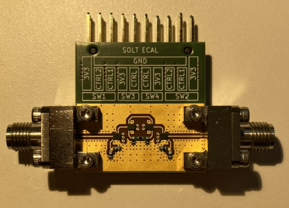
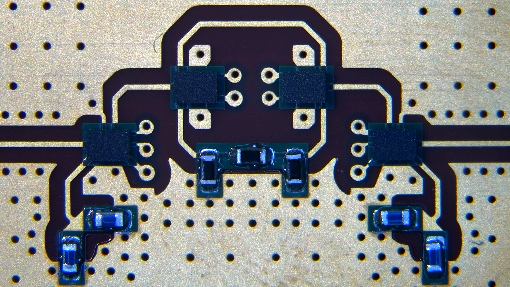
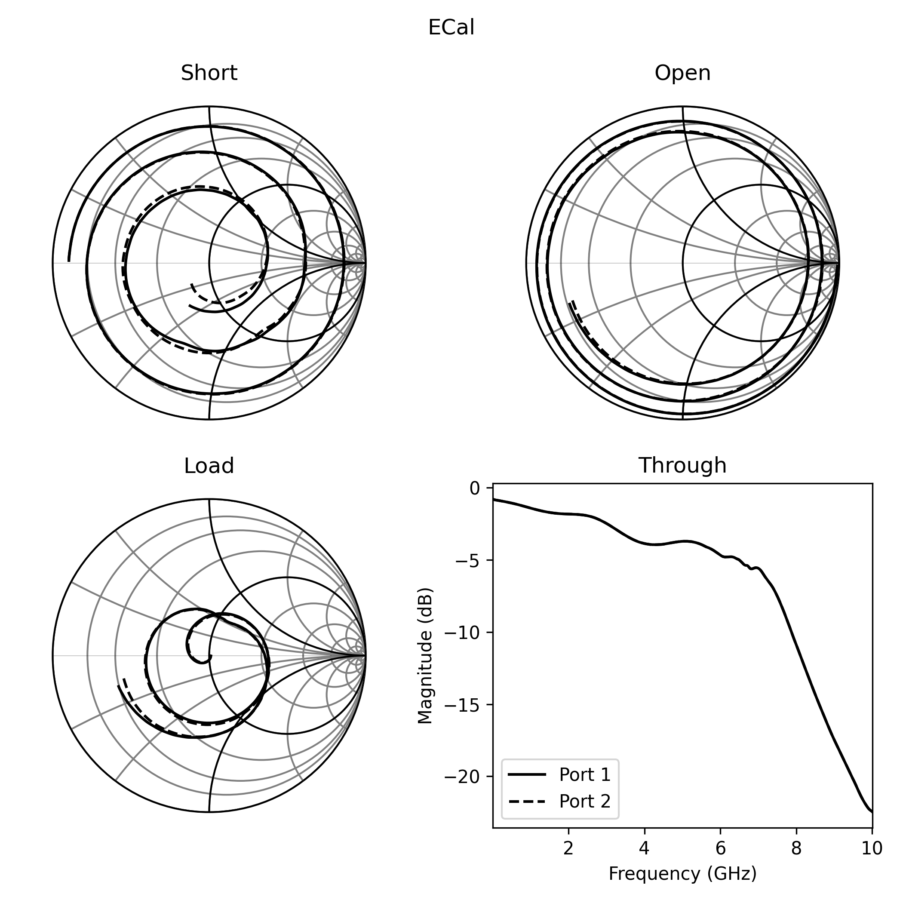
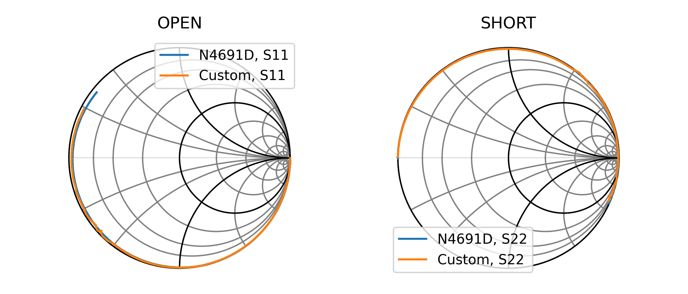
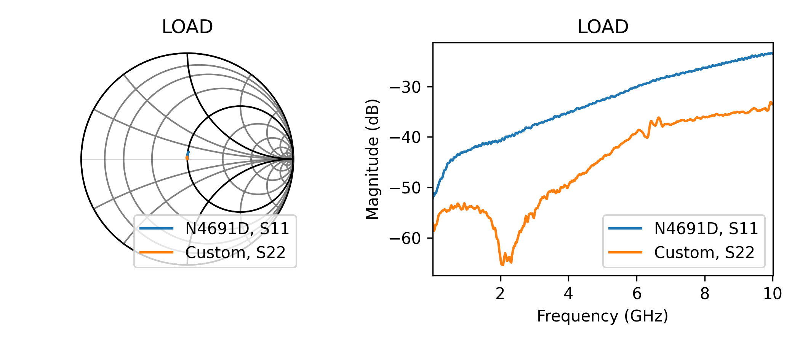
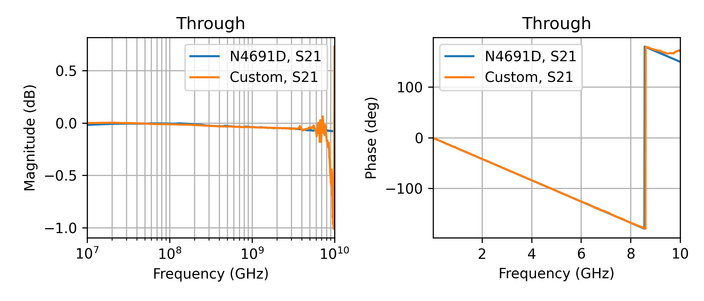

# Switched Calibration Kit (SCal)
DIY calibration module that automatically switches between calibration standards.
The idea is to use of the shelf RF switches with simple SMD resistors, which can be characterized using a reference measurement of a VNA and then used as a standard.

This is a data based approach is bound to imperfections. The other way would be to make a model of the calibration kit and reference that instead of a measurement.
As it is quite difficult to create a model for the switches without knowing the exact layout, the data approach was preferred.
The SCal is characterised and measured on the same day to avoid temperature fluctuations as they will impact the validity of the reference measurement, temperature control should be added on future revisions.

The boards were manufactured using Aisler's [four layer boards](https://community.aisler.net/t/4-layer-hd-pcb-stackup/86) using the Panasonic Prepreg 1080 Type R-1551(W).
The traces were designed to be 50Ω according to Aisler's recommendations.

## First version - Simple, cheap, proof of concept
Calibration kit using Infineon BGS12PN10/BGS14PN10.
- 2 ports
- 50 Ohm path
- Open path
- Short path
- Through path
- 3dB attenuation path

## Board

*Full populated board. High-end K (2.92mm) connectors were used but are definitely not required. Screw on connectors were used to reduce the solder variability during initial measurements.*

*Close-up picture of the switches and standards. The 50Ω terminations are made using two paralell 100Ω resistors on the bottom left and right. The 3dB attenuator path can be seen in the middle, formed as a Π-network.*

## Measurement method
- Perform ECal using the Keysight N4691D calibration kit and the PNA-X
- Measure all of the standards of the custom ECal and save data with calibration applied (reference) and not applied
- Measure the Rosenberger RPC 2.92mm and save data with calibration applied (reference) and not applied
- Attach additional cable to existing cables
- Measure all of the standards of the custom ECal and save raw data (no calibration, raw)
- Measure the Rosenberger RPC 2.92mm and save raw data (no calibration, raw)
- Using Python and scikit-rf package, create a TwelveTerm network calibration using the measured reference ECal standards as ideals and the measured raw ECal standards as measured
- Use this error network to calibrate out the raw measurements of the Rosenberger calibration kit and compare them with the reference measurements

An additional measurement would be a repeatability test:
- Repeatedly measure short/open/load/through standards, making sure you unscrew and screw a different standard in and out each time
- Create the error network using all possible combinations of these measurements
- Measure the variance in error network parameters
- Do the same with the ECal (screw/unscrew after each run), the variance in parameters should be lower considering you don't need to unscrew/screw after measuring each standard

## Results

*Raw measurements of each of the standards. From the open and the short the port offset is visible as is the frequency dependent loss. The through result shows the bandwidth associated with the switches as well as the traces.*

*Comparing the results from the SCal to the Keysight N4691D ECal, we can see comparible results, which look promising.*

*Differences in the measured load, somehow the SCal provides better results than the N4691D.*

*Here we can see the limitations of the measurements/switches. The measured through is nicely characterised up to around 3GHz, after which the SCal starts to deviate.*

## Remarks
The currently used silkscreen is confusing and prone to interconnection errors.
It might be a good idea to allow for rotational symmetry in the connector or to simply swap the legend around.

When looking at the load on the SCal, the S-parameters show that it starts of quite capacitive, which is odd.
This makes modelling it with typical methods difficult.
Maybe removing the whole top ground plane could fix that and only relying on microstrip lines.

The attenuator (not shown) doesn't have good performance, not even close.
Maybe using smaller resistors or a dedicated attenuator chip would be better.

The open and short standard should be located af far away from each other as possible as not to resonate.

The switches used have a minimum frequency in the datasheet.
This minimum frequency was ignored here and did not show up in the results.
However, if they are using PIN diodes to do the switching, the inductors used might not be good enough at lower frequencies, so watch out.

Overall the SCal has very nice results and could be usable for lower frequency measurements.
